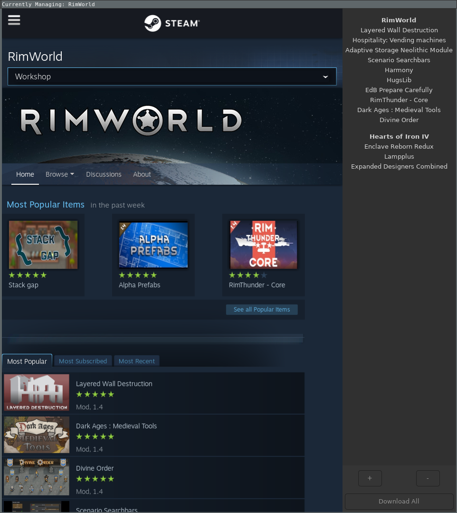

### Steam Harvester

Steam Workshop Item manager for GNU/Linux Systems

## Notes:

* Downloads fail often with SteamCMD, just hit download again
* Currently only works with games that allow anonymous login for workshop items

## Usage:

* Enter Steam Game ID to manage (eg: 294100 for RimWorld) (will autofill if done before)
* `+` when on item page to add to download list
* Select item and hit `-` to remove it
* `Download All` to begin downloading mods in list

Mods saved to `/home/$(USER)/Steam/steamapps/workshop/content/`
Mod list and config options saved to `config.json`